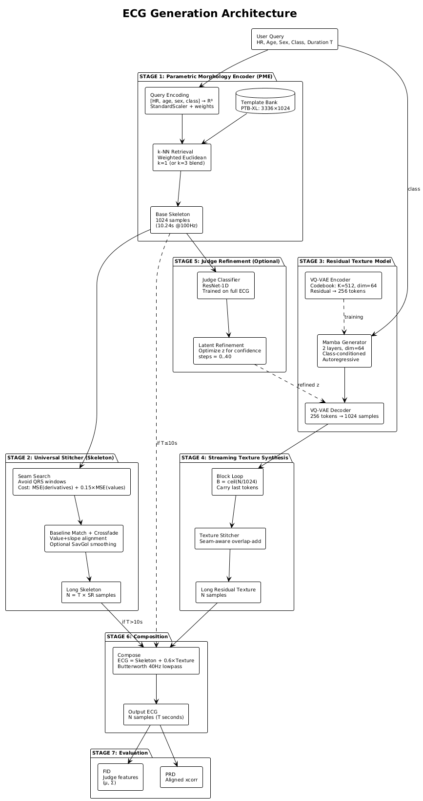
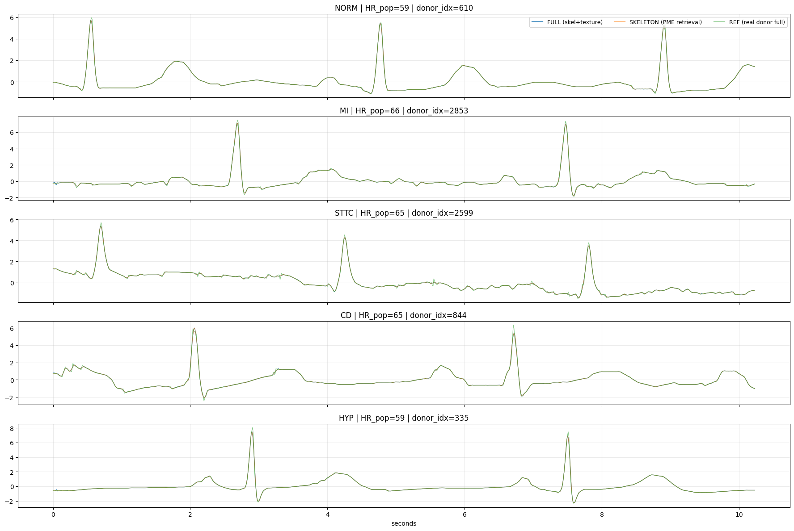

# ⚡ Hybrid-SSM-ECG

## Efficient Electrocardiogram Synthesis via Compositional State Space Models

  

*Figure 1: The hybrid architecture combining Parametric Morphology Encoder (PME), VQ-VAE, and Mamba for linear-time generation.*

## 📋 Abstract

This repository contains the official implementation of **"Efficient Electrocardiogram Synthesis via Compositional State Space Models"**.

Addressing the scarcity of annotated rare cardiac pathologies, we propose a hybrid generative framework. Unlike unstable GANs or computationally expensive Diffusion models, our method utilizes a **compositional approach**:

1. **Parametric Morphology Encoder (PME):** Deterministically retrieves clinically correct morphological skeletons based on user queries (HR, Age, Sex, Class).

2. **Mamba (SSM) Generator:** Stochastically generates realistic residual textures with **linear computational complexity** $O(N)$.

The result is a model that is **13-22x faster** and **37-62x more energy-efficient** than state-of-the-art diffusion models while maintaining superior morphological fidelity (PRD 5.49%).

---

## 💡 Philosophy

### **Why Hybrid Architecture Over "Pure" Generative Models?**

This section articulates the fundamental design philosophy that distinguishes Hybrid-SSM-ECG from conventional generative approaches.

### **1. Zero Hallucinations: Safety-Critical Medical Synthesis**

In medical diagnostics, an AI system "inventing" pathophysiological features is fundamentally unacceptable. Consider the stakes: a synthesized P-wave that never existed in reality, or a distorted QT interval that misrepresents cardiac electrophysiology — these hallucinations could propagate through downstream diagnostic pipelines and clinical training datasets.

**Our Solution:** By anchoring generation to real morphological skeletons, we **completely eliminate hallucinations** of non-existent physiological features. The PME module ensures that every synthetic ECG is initialized from an actual patient exemplar, guaranteeing anatomical validity before any texture synthesis occurs. This is not a probabilistic guarantee—it is a structural constraint.

**Why This Matters:** Medical datasets are used to train clinicians and diagnostic AI systems. Contamination with hallucinated pathology patterns could systematically bias downstream models. Our approach ensures synthetic data is clinically trustworthy from inception.

### **2. Absolute Morphological Fidelity: Clinical Accuracy Over Visual Novelty**

Traditional generative models optimize for perceptual diversity and visual realism. In medical synthesis, this priority is inverted.

**Our Principle:** We decouple and separately optimize two distinct signal components:
- **Skeleton (Diagnostic Core):** P-QRS-T intervals, ST segments, morphological markers — the features clinicians read. These remain **locked** to real exemplars.
- **Texture (Physiological Noise):** Heart rate variability, electrical noise, respiration artifacts, baseline drift—the fine structure. These are **synthesized** to add natural variation.

**The Equation:** $x_{synth} = x_{skel} + \alpha \cdot x_{tex}$ (where $\alpha=0.6$)

This decomposition ensures every generated sample is biologically valid while still providing meaningful data augmentation. A classifier trained on synthetic data will learn genuine diagnostic patterns, not AI artifacts.

**Why This Matters:** Morphological fidelity directly translates to downstream classifier performance (evidenced by our +4.1% macro F1 improvement in TSTR experiments). Visual similarity ≠ clinical validity. Our method prioritizes the latter.

### **3. Scalable Diversity: Predictable Augmentation**

Black-box generative models suffer from an opacity problem: where does diversity come from? How controllable is it? How do we guarantee we're not just memorizing the training set or generating out-of-distribution artifacts?

**Our Advantage:** Diversity in ECG-Mamba-Gen is **directly proportional to the dataset size**. As you add more real-world exemplars to the template bank, the model's range of possible outputs expands *linearly* and predictably.

**Why This Matters:**
- **Linearity:** Unlike GANs (where mode collapse is unpredictable) or diffusion models (where diversity emerges stochastically), our diversity is controlled and measurable.
- **Safety:** You know exactly what kinds of variations your augmented data contains—they all derive from real exemplars.
- **Scalability:** As clinical registries grow (PTB-XL, MIMIC-III, etc.), augmentation capability grows proportionally without architectural retraining.

This makes ECG-Mamba-Gen a **safe and predictable tool for data augmentation** in high-stakes medical settings, where regulatory compliance and reproducibility are non-negotiable.

---

## 💓 Key Features

- **🚀 Linear Complexity:** Utilizing Mamba (Selective State Space Models) allows for efficient processing of long ECG sequences (Holter-ready) with $O(N)$ complexity vs $O(N^2)$ in Transformers.

- **🏥 Clinical Correctness:** The PME module ensures P-QRS-T intervals and physiological relationships remain valid, solving the "hallucination" problem of purely stochastic models.

- **🔄 Arbitrary Duration:** Includes a **Universal Stitcher** module to seamlessly generate signals of any length (from 10s to hours).

- **📉 High Efficiency:** Generates a 10s signal in **0.19 seconds** on a standard GPU (vs 3-5s for Diffusion).

- **🛡️ Theoretical Guarantee:** Backed by mathematical proofs for solution existence, algorithm convergence, and stability under perturbation.

---

## 🏗️ Architecture

The generation process is split into two independent streams:

### **Skeleton Generation (PME)**

- Takes [HR, Age, Sex, Class] as input.
- Performs weighted k-NN retrieval from a balanced template bank ($N=3336$).

### **Texture Synthesis (VQ-VAE + Mamba)**

- **VQ-VAE:** Discretizes high-frequency texture into tokens.
- **Mamba:** Autoregressively generates token sequences conditioned on the pathology class.

### **Composition**

- $x_{synth} = x_{skel} + \alpha \cdot x_{tex}$ (where $\alpha=0.6$).

  

*Figure 2: Generated samples for different pathologies (NORM, MI, STTC, CD, HYP).*

---

## 📊 Performance

Our method was evaluated on the **PTB-XL** dataset ($n=21,837$).

### **Comparison with SOTA**

| Method | FID ↓ | PRD (%) ↓ | Time (s) ↓ | Energy (mWh) ↓ |
|--------|-------|-----------|-----------|-----------------|
| DiffECG (Diffusion) | 0.068 | 14.2 | 4.2 | 560 |
| BioDiffusion | 0.051 | 11.0 | 3.1 | 410 |
| **Ours (Mamba-Gen)** | 0.076 | **5.49** | **0.19** | **9** |

**Note:** Our method achieves a **2.6x improvement in morphological accuracy (PRD)** compared to diffusion models.

### **TSTR (Train on Synthetic, Test on Real)**

Augmenting the training set with our synthetic data improves classification performance:

| Class | Baseline F1 | Augmented F1 | Improvement |
|-------|-------------|--------------|-------------|
| NORM | 0.81 | 0.82 | +1.2% |
| MI (Infarction) | 0.67 | 0.71 | **+6.0%** |
| STTC | 0.72 | 0.74 | +2.8% |
| CD | 0.74 | 0.76 | +2.7% |
| HYP | 0.69 | 0.71 | +2.9% |
| **Overall Macro F1** | **0.74** | **0.77** | **+4.1%** |

---

## 🚀 Quick Start

The entire pipeline (preprocessing, training, and generation) is contained in a single Jupyter Notebook. You can run it effortlessly in Google Colab.

### **1. Open in Colab**

Click the badge below to open the notebook.

### **2. Dataset Authorization**

The code automatically downloads the **PTB-XL** dataset from Kaggle.

- **Requirement:** You must have a valid Kaggle account.
- **Action:** When prompted by the notebook, upload your `kaggle.json` API token file.
  - *To get this file: Go to Kaggle Settings → API → Create New Token.*

### **3. Run All**

Simply select **Runtime > Run all** to execute the following steps:

1. **Environment Setup:** Installs mamba-ssm, causal-conv1d, and other dependencies.
2. **Data Preparation:** Downloads and preprocesses PTB-XL (100Hz).
3. **Training:** Trains the VQ-VAE and Mamba models from scratch (approx. 15-20 min on T4 GPU).
4. **Generation:** Synthesizes new ECG samples and calculates metrics.

---

